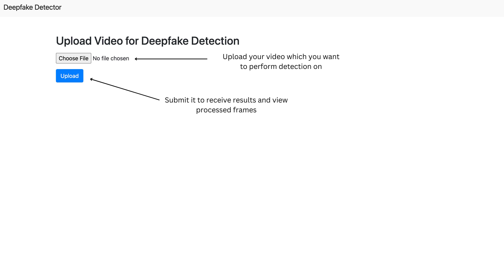
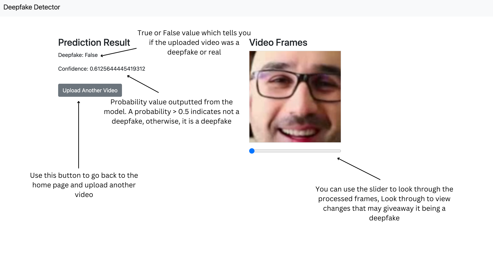

# CS 444 Deepfake Detector using CNNs and LSTMs

### Source the Virtual Environment

To be able to run all the files inside this repository you need to create a virtual environment and install all required packages

First, create the virtual environment:

```bash
python3 -m venv venv
```

Then, enter the virtual environment:

```bash
source venv/bin/activate
```

Finally, install all the required packages:

Note: Make sure you have CMake installed

#### How to install CMake (macOS)

```bash
# Install Homebrew if not already installed
/bin/bash -c "$(curl -fsSL https://raw.githubusercontent.com/Homebrew/install/HEAD/install.sh)"

# Install CMake
brew install cmake

# Verify installation
cmake --version
```

#### How to install CMake (Windows)

```bash
# Using winget
winget install kitware.cmake

# Using Chocolatey
choco install cmake
```

#### How to install CMake (Linux/Ubuntu)

```bash
# Update package list
sudo apt update

# Install CMake
sudo apt install cmake

# Verify installation
cmake --version
```

#### Install Packages

```bash
pip install -r requirements.txt
```

### Instructions for Flask Application

To run the Flask demo application to test on a video, change directory into the Flask folder:

```bash
cd Flask
```

Then, follow the instructions in the README.md file inside that directory to run the Flask application.

### Instructions of Training Code

To run the Training code to train a model, change directory into the Train folder:

```bash
cd Train
```

Then, follow the instructions in the README.md file inside that directory to run the Training code.

### Navigating through the Flask App

#### Step 1: Upload Video



- **Select Video File**: Click the "Choose File" button to select a video from your device.
- **Submit for Detection**: Click the "Upload" button to submit the video for analysis.

#### Step 2: View Results and Frames



- **View Prediction Results**: The application displays whether the video is classified as a deepfake along with a confidence score.
- **Use Slider to View Frames**: Navigate through the extracted frames using the slider below the results.

### Features

- **Interactive Frame Viewer**: Allows users to scroll through video frames using a slider.
- **Near Real-time Results**: Infers and provides feedback from the model, with near real-time speed, on whether the uploaded video is a deepfake.

## Reference(s)

```{=latex}
Li, Y., et al. (2020). Celeb-DF: A Large-scale Challenging Dataset for DeepFake Forensics. IEEE CVPR.
```